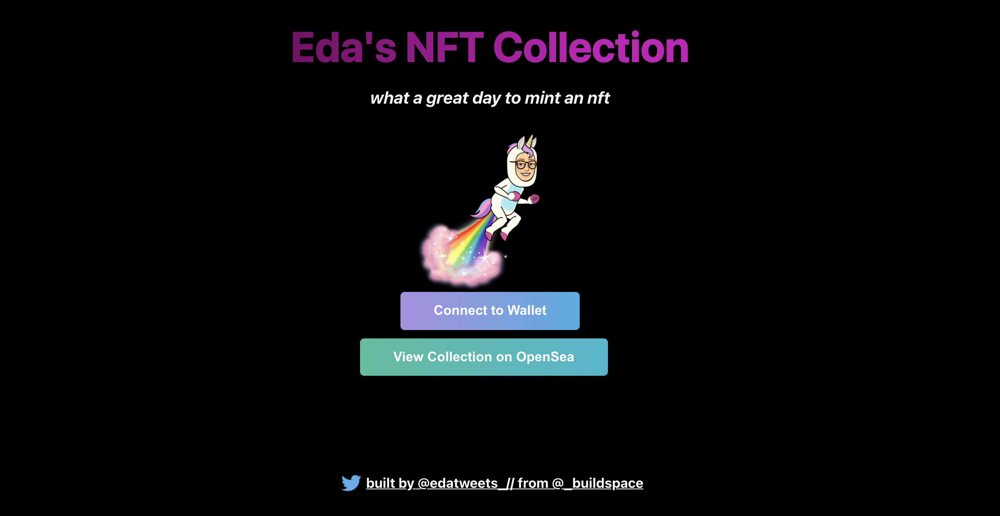

# _buildspace Mint Your Own NFT Collection Project 

UI for _buildspace nft project. 
The contract for the webui can be found here: https://github.com/edakturk14/nft-buildspace-contract

### Tools:
- React: build the ui 
- Hardhat: deploy the contract on the Rinkeby Test network. 
- Alchemy: ethereum api to make request to the test net.
- Metamask: wallet to make transactions on the blockchain

### Demo:

### Webapp:
https://nft-starter-repo-final.edakturk14.repl.co/
